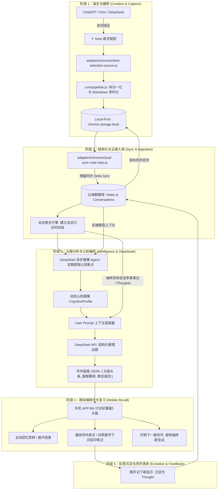

# RFC-003: 跨端协同系统架构与笔记全生命周期设计

**状态**：已确认，准备实施（v0.4）  
**日期**：2026-09-25  
**前置**：RFC-001（Capture → Serialize → Store 主干）、RFC-002（Notes 基础信息架构）  
**关联**：RFC-004（中文百年大报视觉排版与前端界面规范）  

---

## 1. 战略定位演进与跨端解耦

本项目从「单机浏览器扩展」战略升级为 **「跨端协同学习系统」**。系统根据硬件场景与认知模式进行彻底解耦：

```text
┌────────────────────────────────────────────────────────────────────────┐
│                              跨端角色与场景分工                          │
├──────────────────┬──────────────────┬──────────────────────────────────┤
│ 终端 / 硬件形态   │ 典型使用场景      │ 核心职责与关键指标               │
├──────────────────┼──────────────────┼──────────────────────────────────┤
│ PC 浏览器扩展     │ 电脑前深度工作、  │ 【极速捕获 (Capture) & 桌面归档】 │
│ (Chrome MV3)     │ 阅读、学习与编程  │ - Local-First 秒级划词保存 (50ms) │
│                  │                  │ - 完整会话脉络与原网址上下文回溯  │
│                  │                  │ - 彻底剥离重度复习，专注查阅检索  │
├──────────────────┼──────────────────┼──────────────────────────────────┤
│ 云端数据与模型服务│ 云端托管 /       │ 【存储同步 & DeepSeek 认知编排】  │
│ (Cloud Backend)  │ Serverless API   │ - 多端增量数据合并与安全鉴权      │
│                  │                  │ - 会话聚合与时间线索引            │
│                  │                  │ - 认知画像自进化 (Auto-Profiling) │
├──────────────────┼──────────────────┼──────────────────────────────────┤
│ 手机移动端 APP   │ 通勤乘车、排队、  │ 【碎片时间记忆唤醒 (Recall)】    │
│ (Mobile Client)  │ 休息等闲暇碎片时间│ - 打开即见《讨论纪事报》头版自测  │
│                  │                  │ - 多题目层级（头条/要闻/微言）   │
│                  │                  │ - 零打卡压力，一键「印制下一版」  │
│                  │                  │ - 随手沉淀随感批注 (Thought)      │
└──────────────────┴──────────────────┴──────────────────────────────────┘
```

---

## 2. 笔记全生命周期五阶段模型 (Note Lifecycle)

一条笔记从网页中的一段精辟对话，到演化为用户长期认知资产的完整流转过程：



### 阶段 1：诞生与捕获 (Creation & Capture)
- **触发**：用户在 ChatGPT、Kimi、DeepSeek 阅读高价值回答时选中文本。
- **采集内容**：
  - 选区内容（Markdown 主文本 + 兜底 HTML + 纯文本索引）；
  - 讨论上下文指纹：`conversationTitle`（会话名）、`conversationUrl`、`source`（来源平台）、`createdAt`。
- **持久化纪律**：**Local-First**。优先写入 `chrome.storage.local`，确保 50ms 内完成保存与 Toast 提示，不阻断阅读心流。

### 阶段 2：结构化与云端入库 (Sync & Ingestion)
- **实现契约**：在 `adapters/` 中实现 `CloudSyncNoteRepo`，无缝继承 `core/ports.js` 中的 `NoteRepo` 接口（`save` / `list` / `update` / `delete` / `clear`）。
- **增量传输**：仅同步本地未打上 `syncedAt` 标记的增量补丁（Delta），支持离线操作在联网后自动合并（Last-Write-Wins + 字段合并）。

### 阶段 3：云端分析与认知编排 (Cloud Analysis & DeepSeek)
- **模型选型**：DeepSeek-V3（超长 128k 上下文、极高中文语义理解与高推理性价比）。
- **题目生成时机**：
  - 移动端打开或点击「印制下一版自测」时按需实时生成；
  - 云端轻量缓存最近生成的 2~3 期备选号外版面，保证毫秒级无感知切换。
- **输出形态**：强类型的号外版面结构（包含 1 篇深度长逻辑推演题 + 1 篇概念辨析题 + 1 篇微言快问），详见第 4 节。

### 阶段 4：移动端闲暇复习 (Mobile Recall)
- **场景**：用户在通勤、排队或休息时打开手机。
- **交互**：阅读多问题版面，主动在脑海中回忆，轻点展开线索，翻折查看首字下沉的笔记原文对照与 DeepSeek 知识锚点。

### 阶段 5：反思沉淀与闭环演进 (Evolution & Feedback)
- **思考回流**：手机端写下的随笔直接追加至该 Note 的 `thoughts: []` 数组中。
- **模型自适应**：下一次 DeepSeek 出题时，将感知到用户记录的 Thoughts，问题将进一步深化并避免重复出题。

---

## 3. 多端拓扑架构

```text
┌────────────────────────────────────────────────────────────────────────┐
│                              端侧展现层                                 │
├──────────────────────────────────────┬─────────────────────────────────┤
│         PC 端 (Chrome 扩展)           │          移动端 (手机 APP)        │
│  - 纯粹的网页选区采集 (DOM Source)     │  - 闲暇碎片自测流 (Broadsheet)   │
│  - 桌面端笔记与对话列表查阅            │  - 多问题层次 (头条/要闻/微言)   │
│  - 本地优先 (Local-First Storage)     │  - 随手反思批注 (Thought Notes)  │
│  - 增量同步上传 (CloudSyncNoteRepo)   │  - 换一批 / 印制下一版自测       │
└──────────────────┬───────────────────┴────────────────┬────────────────┘
                   │ HTTPS / REST                       │ HTTPS / REST
                   ▼                                    ▼
┌────────────────────────────────────────────────────────────────────────┐
│                              云端服务中枢                               │
├────────────────────────────────────────────────────────────────────────┤
│  1. 同步与认证网关 (Sync Gateway)                                      │
│     - 用户 Token 鉴权 / 增量数据上报与下发 (Delta Sync)                 │
│                                                                        │
│  2. 笔记数据中心 (Note Data Store)                                      │
│     - 笔记表 (Notes) / 会话表 (Conversations) / 批注表 (Thoughts)      │
│                                                                        │
│  3. 智能复习编排器 (Recall & Prompt Engine)                             │
│     - 认知画像 Agent (定期提炼用户的 activeTopics 与 recentShift)       │
│     - 会话上下文装配器 (组装同一会话的多篇连续笔记及历史 Thoughts)     │
│     - DeepSeek API 客户端 (统一兼容 OpenAI 协议)                       │
│     - 号外自测版面缓存池                                               │
└──────────────────────────────────┬─────────────────────────────────────┘
                                   │ HTTPS
                                   ▼
┌────────────────────────────────────────────────────────────────────────┐
│                       DeepSeek 认知分析模型                             │
│  - deepseek-chat (V3): 128k 超长上下文、启发式出题与多问题结构化推理   │
└────────────────────────────────────────────────────────────────────────┘
```

---

## 4. Prompt 工程规范与模型自进化机制

### 4.1 固化的 System Prompt（系统准绳）

System Prompt 专注于**出题哲学、多栏目层次与强类型 JSON 输出规范**，长期稳定不变：

```markdown
# 角色
你是用户的长期认知伙伴与苏格拉底式复习助教。
你的目标是根据用户过去在与 AI 对话中记录的笔记上下文，在《AI 讨论纪事报》头版为用户印制一份充满信息浓度与思辨张力的多问题自测号外。

# 核心出题法则
1. 【头版头条 · 深度推演 (q1)】：
   - 针对目标笔记的核心因果逻辑、架构设计权衡或本质机制进行启发式提问（问“为什么”而非死记硬背）；
   - 必须提供一条模糊的【思考线索 (clue)】，辅助回忆但不剧透答案；
   - 提取原笔记核心知识机制，撰写一句精悍的【记忆锚点 (anchor)】。
2. 【报眼要闻 · 概念辨析 (q2)】：
   - 针对同会话中出现的关联概念或容易混淆的边界进行辨析提问（如 A 与 B 的本质区别）；
   - 给出精简解析。
3. 【微言速测 · 一问快答 (q3)】：
   - 针对一个具体的极端场景或边界条件，提出一问一答的快闪自测题。

# 严格输出规范 (JSON 格式)
必须以合法的 JSON 格式返回，禁止任何额外的 Markdown 代码块包裹：
{
  "issueId": "string, 唯一版号如 issue_hex_01",
  "seriesName": "string, 所属专栏如 Python 六层架构专栏",
  "leadSource": "string, 来源与时间如 ChatGPT · 昨天 16:10",
  "q1": {
    "title": "string, 头版头条深度推演大标题",
    "sub": "string, 引言副标题",
    "clue": "string, 思考线索",
    "anchor": "string, DeepSeek 记忆锚点",
    "targetNoteId": "string, 核心笔记 ID"
  },
  "q2": {
    "title": "string, 概念辨析自测题",
    "body": "string, 辨析要点解析"
  },
  "q3": {
    "title": "string, 微言速测快问",
    "body": "string, 快答答案"
  }
}
```

### 4.2 User Prompt 自演进机制（大模型自主追踪主题）

为了解决用户学习主题随时间流转（如由 Python 架构迁移到分布式系统）的问题，系统通过 **「异步轻量画像提炼 + 实时上下文拼接」** 实现零人工维护：

#### 步骤 1：后台静默画像演进（每积累 5~10 篇笔记触发一次）
系统在后台让 DeepSeek 观察近期笔记的标题与摘录，提炼一份极轻量的认知画像：
```json
{
  "updatedAt": "2026-09-25T18:00:00Z",
  "activeTopics": ["Python 六层架构与领域防腐", "分布式共识 Raft 算法"],
  "recentShift": "从单体业务框架转向系统解耦与分布式状态机设计",
  "dormantTopics": ["Docker 基础运维", "TailwindCSS 配置"]
}
```

#### 步骤 2：出题时的 User Prompt 动态装配
移动端请求新号外时，装配器自动合并：
- **宏观认知画像**（当前活跃主题与兴趣跃迁）；
- **微观上下文**（目标会话的 2~4 条连续笔记正文、标题、URL 及已有 Thoughts）。

生成如下标准的 User Prompt：
```markdown
【宏观认知画像】
- 用户近期活跃主题：Python 六层架构与领域防腐、分布式共识 Raft 算法
- 近期兴趣跃迁：从单体业务框架转向系统解耦与分布式状态机设计

【本次抽样聚焦的目标会话脉络】
- 专栏名称：Python 六层架构学习 (来源: ChatGPT)
- 笔记 1: [持久化适配器负责 Repository 端口解包装包...]
- 笔记 2 (核心聚焦): [防腐层 ACL 隔离外部不稳定契约，保护核心领域...]
- 用户历史批注: "防腐层是最关键的中继转换带"

【出题要求】
请围绕上述会话脉络，按照 System Prompt 的结构化规范，印制一份包含【深度推演 q1】、【概念辨析 q2】、【微言速测 q3】的完整号外 JSON。
```

---

## 5. 数据模型与契约扩展

在现有 `Note` schema v2（`core/note.js`）的基础上保持平滑兼容，新增云同步与复习关联元数据：

```typescript
interface NoteSchemaV3 extends NoteSchemaV2 {
  // 保持现有字段完全兼容
  id: string;
  schemaVersion: 2 | 3;
  contentMarkdown: string;
  contentText: string;
  contentHtml: string;
  source: string;
  sourceType: string;
  conversationTitle: string;
  conversationUrl: string;
  thoughts: Array<{
    id: string;
    text: string;
    createdAt: string;
  }>;
  createdAt: string;

  // v3 新增可选同步与复习元数据 (存储于 metadata 内或作为顶层可选字段)
  metadata: {
    host?: string;
    syncedAt?: string;      // 云端同步时间戳
    dirty?: boolean;        // 本地修改待推送标记
    lastRecalledAt?: string;// 最近一次被作为题目自测的时间
    recallCount?: number;   // 自测唤醒次数
  };
}
```

---

## 6. 核心接口与适配器架构 (Hexagonal Integration)

得益于项目的六边形架构，整体改造直接映射至现有端口（`core/ports.js`）：

```text
core/
├── ports.js                 # 接口定义（NoteRepo, CaptureSource, KV）
├── note.js                  # Note 实体与迁移逻辑（前后端完全复用）
├── group.js                 # 会话分组与统计（纯函数，前后端复用）
└── recall/                  # [新增] 复习编排纯模块
    ├── prompt-builder.js    # 双层 User Prompt 组装器
    └── response-parser.js   # 号外 JSON 校验与解析器

adapters/
├── chrome/
│   ├── storage-note-repo.js # 本地 Local-First 存储
│   └── cloud-sync-note-repo.js # [新增] 云端增量同步适配器
└── llm/
    └── deepseek-client.js   # [新增] DeepSeek (OpenAI 协议) 客户端
```
